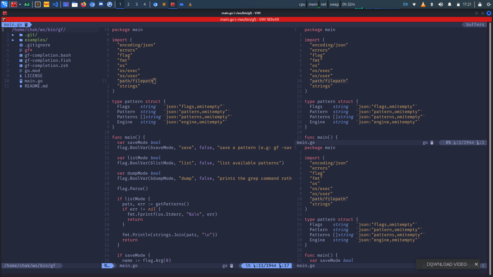
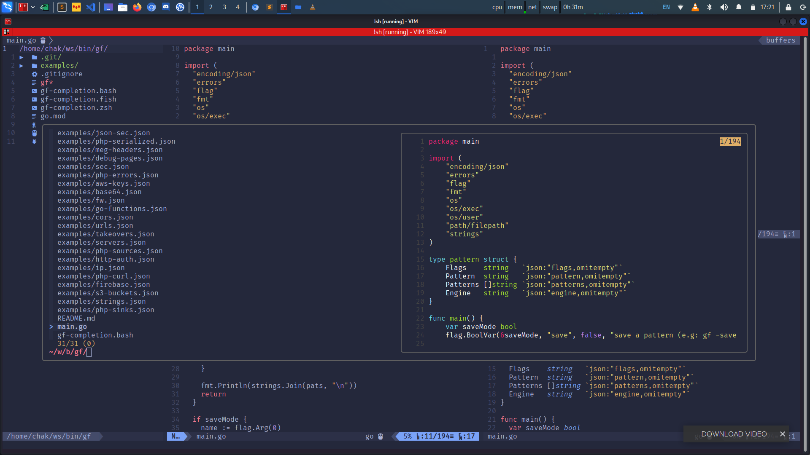
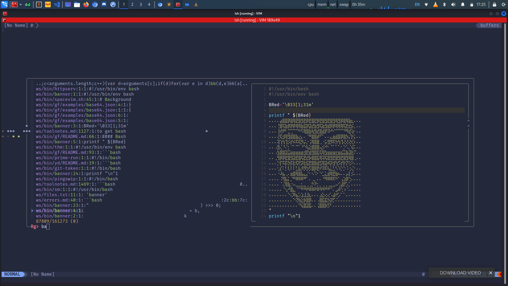

# Making Vim act like Lvim and Vscode Ide from scratch
for those who want lvim but vim to much that they can't shift to nvim/lvim
### Screenshots



### Installing Pre-Dependencies

- install Vundle 

		git clone https://github.com/VundleVim/Vundle.vim.git ~/.vim/bundle/Vundle.vim

- install Plug

`curl -fLo ~/.vim/autoload/plug.vim --create-dirs \
    https://raw.githubusercontent.com/junegunn/vim-plug/master/plug.vim`

- install dein

		curl https://raw.githubusercontent.com/Shougo/dein.vim/master/bin/installer.sh > installer.sh
		sh ./installer.sh ~/.cache/dein
		mkdir -p ~/.vim/rc
		touch ~/.vim/rc/dein_lazy.toml
		touch ~/.vim/rc/dein.toml

`dien is just for incase you want to install plugins but you are to lazy install using Plug`
		

- install nvm,nodejs,npm,yarn,prettier,stylua,cargo
			
		curl -o- https://raw.githubusercontent.com/nvm-sh/nvm/v0.39.1/install.sh | bash

```bash
export NVM_DIR="$([ -z "${XDG_CONFIG_HOME-}" ] && printf %s "${HOME}/.nvm" || printf %s "${XDG_CONFIG_HOME}/nvm")"
[ -s "$NVM_DIR/nvm.sh" ] && \. "$NVM_DIR/nvm.sh" # This loads nvm
```

		nvm install --lts

		npm install --global yarn

		apt install cargo 

		cargo install stylua
		cargo install stylua --features lua52
		cargo install stylua --features luau

for pretier installation follow [prettier](https://prettier.io/docs/en/install.html)

- install other dependencies

`for debian based for other distro check their package manager`
		
		sudo apt install bat fzf ripgrep universal-ctag fd-find shellcheck codespell flake8

- installation of config

		rm -rf ~/.vimrc
		curl -fLo ~/.vimrc --create-dirs \
   			https://raw.githubusercontent.com/BL4CK-R34P3R/vim/main/.vimrc

---

#### Configuration Complete

after running vim do:

		:PlugInstall
		:VundleInstall

and to install lsp server using coc do:

		:CocInstall coc-servername

lsp installation using Lsp
		
		:LspInstallServer

while you are on supported language
